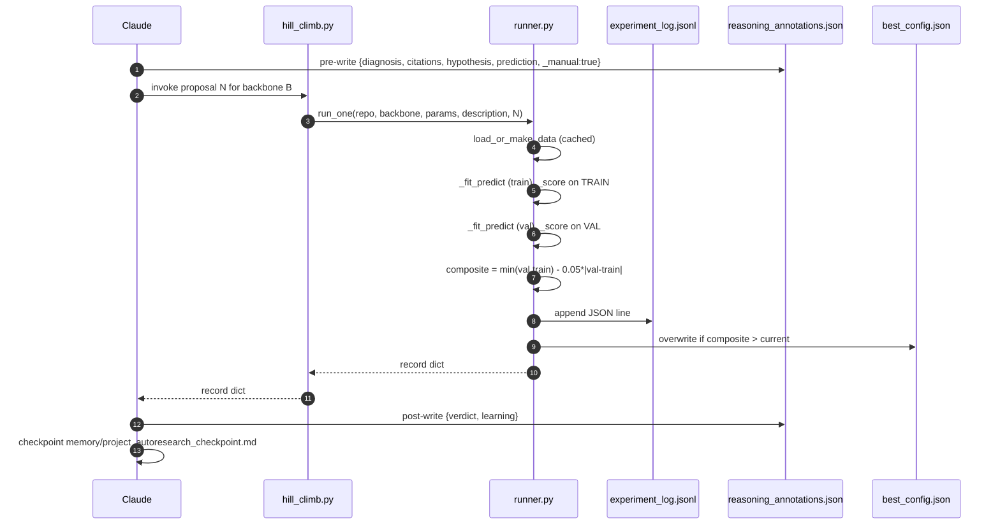
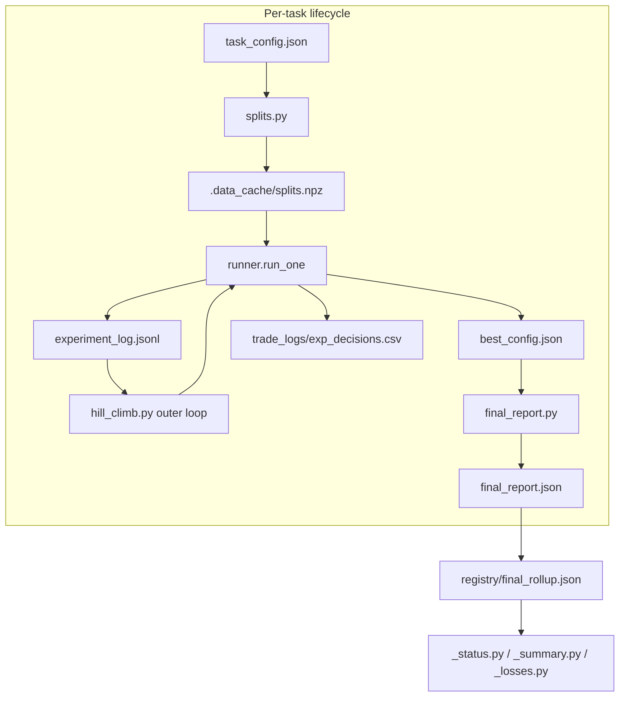

# Runtime — Process Lifecycle, P-Core Pinning, GPU Memory

> Audience: an engineer running the loop locally or porting it to another machine.

## 1. The hardware contract

The reference machine is an Intel 14th-gen HX laptop with hybrid P-cores / E-cores and a 16 GB Ada-class GPU. WHEA-Logger reported internal parity errors on CPU APIC IDs 16, 17, 24, 25 — all E-cores. Sustained compute on E-cores BSODs the laptop. The runtime contract therefore is:

| Resource | Budget | Enforced by |
|---|---|---|
| CPU | P-cores only (logical IDs 0,2,4,6); 4 threads default | `framework.runner._pin_to_safe_cores()` |
| GPU VRAM | ≤ 16 GB (3 GB params FP32, 6 GB opt state, 3 GB grads, 3 GB activations, 1 GB reserved) | Pre-flight check in Experiment 1 reasoning annotation for each new backbone |
| RAM | 64 GB; not a binding constraint | — |
| Disk | `.data_cache/splits.npz` per task (≤ 5 MB each) | `_write_manifest` |

`_pin_to_safe_cores()` is the literal first call in `runner.py`. Skipping it crashes the laptop within ~3 minutes of sustained gradient computation. The escape hatch is `AUTORESEARCH_USE_ALL_CORES=1` for non-sustained debugging only — do not commit any setting that enables it.

```python
def _pin_to_safe_cores() -> None:
    if os.environ.get("AUTORESEARCH_USE_ALL_CORES") == "1":
        return
    n_threads = int(os.environ.get("AUTORESEARCH_N_THREADS", "4"))
    torch.set_num_threads(n_threads)
    psutil.Process().cpu_affinity([0, 2, 4, 6][:n_threads])
    os.environ["OMP_NUM_THREADS"] = str(n_threads)
    os.environ["MKL_NUM_THREADS"] = str(n_threads)
    os.environ["OPENBLAS_NUM_THREADS"] = str(n_threads)
```

See [`../runbooks/01_resume_after_crash.md`](../runbooks/01_resume_after_crash.md) for the recovery procedure.

## 2. Per-experiment lifecycle

Each call to `framework/runner.py:run_one` is one experiment. The shape:



The runner never spawns a thread that survives the call. Each `run_one` is start-clean.

## 3. Crash-recovery checkpoint

The system **must** be resumable from a fresh Claude Code session reading only `CLAUDE.md` + `memory/project_autoresearch_checkpoint.md`. The checkpoint contains:

1. Current champion config + composite.
2. Per-fold validation table for the champion (TRAIN / VAL only).
3. Last experiment result (config, composite, delta vs champion, KEEP/DISCARD).
4. The EXACT next PowerShell command (copy-pasteable).
5. Rationale for the next experiment (diagnosis + literature cite + hypothesis).
6. All wired parameters and their CLI flags.
7. Exhausted-axis notes from prior experiments.

Triggers (all mandatory):
1. After every experiment completes.
2. Every 5 minutes of reasoning.
3. Before any code change.
4. After any code change.
5. Before starting the next experiment.

See `framework/CLAUDE_template.md` § "Crash-Recovery Checkpointing" and [`../adr/0014_github_checkpoint_protocol.md`](../adr/0014_github_checkpoint_protocol.md).

## 4. Backbone surface

`framework/runner.py:_fit_predict` dispatches by backbone name:

| Backbone | Library | Used for |
|---|---|---|
| `xgboost` | xgboost | tabular default — GBM baseline |
| `lightgbm` | lightgbm | leaf-wise GBM with GOSS |
| `catboost` | catboost | ordered boosting for categorical-heavy tabular |
| `mlp` | sklearn `MLPClassifier`/`MLPRegressor` (with `early_stopping=True`) | dense feedforward baseline |
| `ft_transformer` | sklearn `HistGradientBoosting*` (proxy) | FT-Transformer family — Gorishniy et al. 2021 'Revisiting Deep Learning Models for Tabular Data' (arXiv:2106.11189), approximated with HistGB at hill-climb speed |
| `lstm` | torch `nn.LSTM` | sequence / time-series tabular |
| `patchtsmixer` | torch (channel-mix MLP) | patch-TSMixer flavoured MLP for tabular |
| `excel_agent` | sklearn + per-task priors | `qa_excel` only — see [`04_hill_climb.md`](04_hill_climb.md) §3 |

Each backbone has a `code_versions/<backbone>_start/` snapshot before its 25-iter phase begins, so we can diff what changed inside that backbone's exploration. Imports are guarded; if the library is missing, `_sklearn_fallback` produces a `GradientBoosting*` substitute and logs the substitution.

## 5. Cooldown and resource hygiene

The base hill-climb has a 30-second cooldown per experiment (override via `COOLDOWN_SEC`) to let GPU/CPU thermals stabilise. The test-mode default is `0` for fast iteration; production runs should keep the 30-second budget per the protocol.

## 6. Process tree

```
PowerShell (foreground)
└── python framework/run_all.py [--kind modeling|analysis] [--all]
    └── for each task:
        ├── python framework/hill_climb.py --repo <task> --backbone <b> --params <json> --description <s> --experiment-num <n>
        │   └── runner.run_one(...)  # one experiment per call, cooldown, checkpoint
        └── python framework/extended_hill_climb.py --repo <task>  # only on loss tasks
```

Background jobs write stdout to `registry/run_all_stdout.log` and `registry/run_all_analysis_stdout.log` for the live `_status.py` snapshot.

## 7. Diagrams



See also [`diagrams/per_experiment_lifecycle.mmd`](diagrams/per_experiment_lifecycle.mmd) for the full per-experiment sequence.

## 8. Related

- [`02_data_model.md`](02_data_model.md) — what runs produce.
- [`04_hill_climb.md`](04_hill_climb.md) — the loop that drives the runner.
- [`../runbooks/01_resume_after_crash.md`](../runbooks/01_resume_after_crash.md) — recovery procedure.
- [`../adr/0001_use_synthetic_data_until_real_loaders.md`](../adr/0001_use_synthetic_data_until_real_loaders.md) — why early runs used synthetic Gaussian data.
