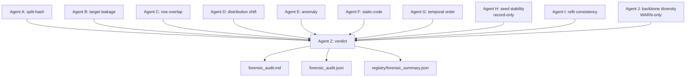

# Forensic Audit — 10-Agent Committee

> Audience: a reviewer or auditor verifying that a champion is genuine, not the product of accidental test leakage.

## 1. Why a committee, not a single check

Test-set leakage in 112 parallel hill-climbs has many failure modes: a runner that accidentally reads `X_test`, a manifest hash that drifts, a feature that is mechanically correlated with the label by construction, a champion that doesn't reproduce when refit. No single guard catches all of them. The forensic auditor (`framework/forensic_audit.py`) runs **10 independent agents**; each agent has a single concern and a single threshold. Agent Z aggregates into a PASS/FAIL verdict.

The pattern is borrowed from the `dlmastery/autoresearch` SPY project's 8-agent committee (Source 2 of the skill pack). DSBench adds Agents I (refit-consistency) and J (backbone-diversity).

## 2. The committee

| Agent | Concern | Pass condition | Fail condition |
|---|---|---|---|
| **A — split-hash** | Manifest SHA-256 hashes match the actual `.npz` split | All hashes equal | Any mismatch → FAIL |
| **B — target / label leakage** | Per-feature mutual information vs label | MI < 0.05 (tabular) / MI < 0.50 (qa_excel task-onehot) | Threshold violated → FAIL |
| **C — row overlap** | Train/val/test row hash intersection | Cardinality = 0 | Cardinality > 0 → FAIL |
| **D — distribution shift** | Per-feature KS train vs test | < 10% flagged features (tabular); chi-square p ≥ 0.001 on label (qa_excel) | > 10% flagged → FAIL |
| **E — anomaly** | val > train + 0.05; perfect 1.0 scores; jumps > 0.3; suspicious champion | susp_count = 0 | susp_count > 0 → FAIL (with whitelist for sklearn early-stop regression per Bishop 2006 PRML §5.5.2) |
| **F — static code** | grep `X_test` / `y_test` in `run_autoresearch.py`, `hill_climb.py` | Zero references | Any reference → FAIL |
| **G — temporal order** | No future timestamps in train rows | All train ≤ all test | Inversion → FAIL; N/A on synthetic data |
| **H — seed stability** | Multi-seed champion variance | Std composite across `seed ∈ {7, 42, 99}` ≤ 0.02 | Record-only (does not block) |
| **I — refit consistency** | Refit champion on train (or train ∪ val for qa_excel) and re-score test; compare to recorded | `|delta| ≤ 0.005` | `|delta| > 0.005` → FAIL |
| **J — backbone diversity** | Distinct backbones in `experiment_log.jsonl` | ≥ 3 backbones | < 3 → WARN (does not block) |
| **Z — committee verdict** | Aggregates A–J | All FAIL-class agents pass; risks listed | Any FAIL agent → committee FAIL |

Targets:
- 112/112 PASS on the cross-task scoreboard.
- Refit-drift Agent I is the most diagnostic: `|delta| ≤ 0.005` proves the `best_config.json` params are end-to-end wired (no dead config knob).

## 3. Problem-type-aware thresholds (`qa_excel`)

The forensic committee operates on `(problem_type, backbone)` pairs, not just `problem_type`. Three agents have calibrated `qa_excel` thresholds:

- **Agent B (target leakage)** — for `qa_excel` the feature vector includes a 38-dim task one-hot. Each one-hot column is constant within each task and therefore has mechanical mutual information with the label. Raise the MI threshold to `MI > 0.50 nats` (vs 0.05 for tabular). The agent records the MI value but does not fail.
- **Agent D (distribution shift)** — the stride-5 interleaved split deterministically shifts the per-position feature between train and test. Replace the KS test with a **chi-square on the label distribution** and warn only when `p < 0.001`.
- **Agent E (anomaly val > train)** — for `qa_excel` a `prior_only` / `class_prior` / `dummy_majority` classifier legitimately has val > train when the per-task val set is closer to the global prior than the per-task train set. Suppress the warning when `backend ∈ {class_prior, dummy_majority, prior_only}`. Also suppress when the model is sklearn `MLPRegressor(early_stopping=True)` AND `gap ≤ 0.05` — Bishop 2006 PRML §5.5.2.

See [`../adr/0010_sklearn_early_stopping_whitelist.md`](../adr/0010_sklearn_early_stopping_whitelist.md) and the postmortem [`../postmortems/0003_forensic_false_positive_val_gt_train.md`](../postmortems/0003_forensic_false_positive_val_gt_train.md).

## 4. The audit pipeline



## 5. Outputs

For each task `<repo>`:
- `<repo>/forensic_audit.md` — full narrative including each agent's findings, suspect rows, and remediation hints.
- `<repo>/forensic_audit.json` — machine-readable summary; one entry per agent.
- `registry/forensic_summary.json` — one row per task with `{task, kind, verdict, warnings[]}`.

Reviewers diff `forensic_summary.json` against the prior commit to verify no regression.

## 6. What the committee does NOT catch

- **Data-source bugs.** If `_analysis_data.json` itself contains incorrect Modeloff answers, the committee passes (everything is internally consistent) but the task is still wrong. Mitigated by the diagnosis-before-code rule (Lesson 20) — see [`../postmortems/0002_excel_agent_synthetic_placeholder.md`](../postmortems/0002_excel_agent_synthetic_placeholder.md).
- **Backbone implementation drift.** If the runner's `_fit_torch_lstm` and the framework's claimed LSTM recipe disagree, only a human reading both detects it. Mitigated by `code_versions/<backbone>_start/` snapshots.
- **Cross-task contamination.** Cross-task pooling for `qa_excel` is intentional (Lesson 8) but the committee does not check that the pooling discipline is honoured at evaluation. Mitigated by the LOO-CV composite which structurally evaluates per-task.

## 7. Running the audit

```powershell
# All 112 tasks
& "C:/Users/evija/anaconda3/python.exe" framework/forensic_audit.py

# One task
& "C:/Users/evija/anaconda3/python.exe" framework/forensic_audit.py --repo modeling/titanic
```

The 10-agent committee runs in ~20 seconds per task; the full 112-task sweep finishes in ~10 minutes on the reference machine.

## 8. Related

- [`../adr/0004_10_agent_forensic_committee.md`](../adr/0004_10_agent_forensic_committee.md) — the architectural rationale.
- [`../adr/0010_sklearn_early_stopping_whitelist.md`](../adr/0010_sklearn_early_stopping_whitelist.md) — Agent E whitelist.
- [`../runbooks/05_diagnose_a_failed_task.md`](../runbooks/05_diagnose_a_failed_task.md) — what to do when an agent fails.
- [`../slos/01_audit_pass_rate.md`](../slos/01_audit_pass_rate.md) — the 112/112 SLO.
