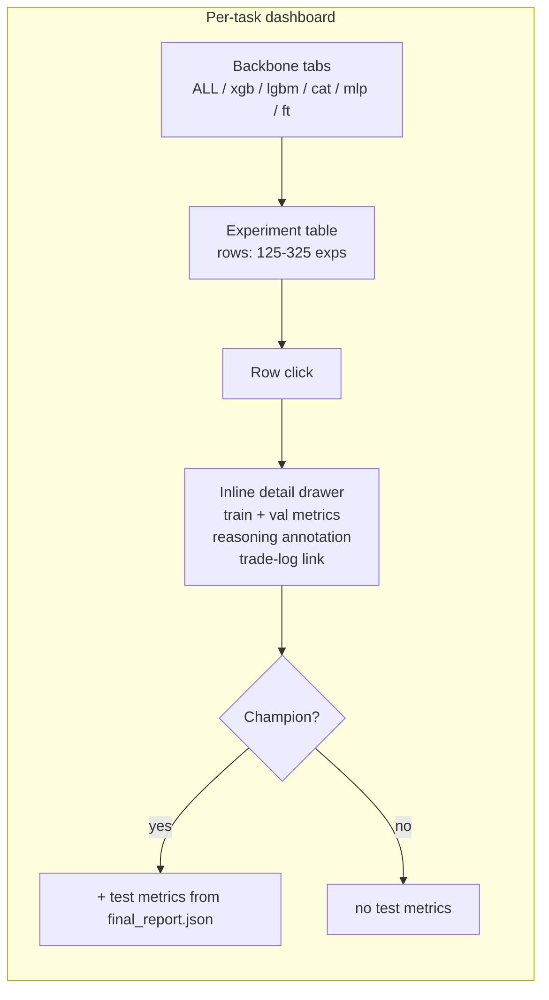

# Dashboards — Cross-Task, Per-Task, md_viewer, and UX Rules

> Audience: someone reading the dashboards (cross-task leaderboard or per-task experiment table) or extending them.

## 1. Three dashboards

| Dashboard | URL (local) | Source | Purpose |
|---|---|---|---|
| Cross-task leaderboard | `dashboard/index.html` | `registry/final_rollup.json` + `registry/forensic_summary.json` | All 112 tasks, sortable by composite / DSBench delta / forensic verdict. |
| Per-task | `modeling/<slug>/autoresearch_results/dashboard.html` (and analysis equivalent) | local `experiment_log.jsonl`, `reasoning_annotations.json`, `best_config.json` | One task's full hill-climb ledger with backbone tabs, sortable experiments, inline detail panel. |
| Markdown viewer | `dashboard/md_viewer.html?path=<relative>` | any `.md` artefact | Client-side render of `summary.md`, `journal.md`, `paper.md`, `CLAUDE.md`, `forensic_audit.md`, `checkpoint.md`. |

The md_viewer exists because Chromium-family browsers download `.md` files by default. Linking to any `.md` directly serves a download, so every link in the dashboards routes through `md_viewer.html?path=<relative>`. See [`../adr/0011_md_viewer_inline_render.md`](../adr/0011_md_viewer_inline_render.md).

## 2. Navigation rules (the two-tab contract)

Two strict rules govern dashboard navigation. See [`../adr/0012_two_tab_navigation.md`](../adr/0012_two_tab_navigation.md).

1. **Cross-task → per-task** opens in a **new browser tab**. Implementation: `<a href="..." target="_blank" rel="noopener">`. No modals, no in-place navigation, no JS `window.location` mutation.
2. **Per-task experiment row click** opens an **inline detail panel** within the same dashboard. Implementation: vanilla-JS click handler that toggles a `<div class="detail-drawer">` sibling beneath the row.

The asymmetry is intentional. Cross-task is a navigation surface (jump to a task); per-task is a drill-down (read details without leaving context).

## 3. The "About this task" disclosure

Every per-task dashboard MUST have a collapsible `<details>` block near the top:

```html
<details class="about-this-task">
  <summary>About this task</summary>
  <table>
    <tr><th>Task</th><td>titanic</td></tr>
    <tr><th>Source</th><td><a href="https://www.kaggle.com/c/titanic">kaggle.com/c/titanic</a></td></tr>
    <tr><th>Problem type</th><td>classification_binary</td></tr>
    <tr><th>Metric</th><td>roc_auc (higher is better)</td></tr>
    <tr><th>Backbones explored</th><td>xgboost, lightgbm, catboost, mlp, ft_transformer</td></tr>
    <tr><th>DSBench baseline</th><td>0.50</td></tr>
    <tr><th>Champion delta</th><td>+0.4624</td></tr>
    <tr><th>CLAUDE.md</th><td><a href="../../dashboard/md_viewer.html?path=...">read</a></td></tr>
    <tr><th>Skill pack</th><td><a href="...">autoresearch-pack</a></td></tr>
  </table>
</details>
```

The fields are populated by `framework/_refresh_dashboards.py` from `task_config.json` + the registry. The skill is `task-description-disclosure` (Lesson 11).

## 4. Train / val / test exposure

The per-task experiment row exposes train AND val metrics in the inline detail panel for **every experiment**. Test metrics ONLY render for the global-champion row and are sourced from `autoresearch_results/final_report.json`. This is the structural reason the test set never leaks into hill-climbing decisions: the dashboard physically has no test-metric column for non-champion rows. See [`../adr/0002_train_val_only_for_hill_climb.md`](../adr/0002_train_val_only_for_hill_climb.md).



## 5. Backbone tabs

Above the experiment table, a tab bar lets the user filter by backbone. Default view is "ALL". The tabs match `task_config.json:backbones` order. The implementation is a tiny vanilla-JS filter that hides/shows rows by `data-backbone` attribute — no framework dependency. Skill: `dashboard-backbone-tabs`.

## 6. Auto-refresh

Both dashboards auto-refresh every 30 seconds via `setInterval(load, 30000)` (Lesson 26). A long-running background hill-climb's progress is visible without manual reload — the reviewer keeps the tab open and watches the leaderboard update live.

## 7. The cross-task leaderboard layout

The cross-task table at `dashboard/index.html` shows one row per task:

| Task | Kind | Problem | Champion backbone | Composite (val) | Test | DSBench | Delta | Forensic verdict |
|---|---|---|---|---|---|---|---|---|

Sortable by every column. The forensic verdict column links to the per-task `forensic_audit.md` via `md_viewer.html?path=...`. PASS rows are green; FAIL rows red; missing rows grey.

## 8. Dashboard file write contract

Every experiment updates the ENTIRE following table (skill: `dashboard-files-update-mandate`):

| File | Writer | When |
|---|---|---|
| `experiment_log.jsonl` | runner | every run |
| `best_config.json` | runner | on new global champion only |
| `best_model.pkl` | runner | on new global champion only |
| `trade_logs/exp<N>_decisions.csv` | runner | every run |
| `trade_logs/exp<N>_decision_summary.json` | runner | every run |
| `reasoning_annotations.json` | Claude pre + runner post-fallback | every run |
| `research_journal.md` | Claude | every run |
| `experiment_summary.md` | Claude | every run |
| `memory/project_autoresearch_checkpoint.md` | Claude | every run |
| `winners/<...>/*` | Claude | on new global champion only |

Skipping any row is a protocol violation; the validator and forensic auditor catch most omissions.

## 9. Related

- [`../adr/0011_md_viewer_inline_render.md`](../adr/0011_md_viewer_inline_render.md)
- [`../adr/0012_two_tab_navigation.md`](../adr/0012_two_tab_navigation.md)
- [`../onboarding/04_reading_a_dashboard.md`](../onboarding/04_reading_a_dashboard.md)
- `framework/dashboard_template.html` (the source)
- `framework/_refresh_dashboards.py` (the regenerator)
