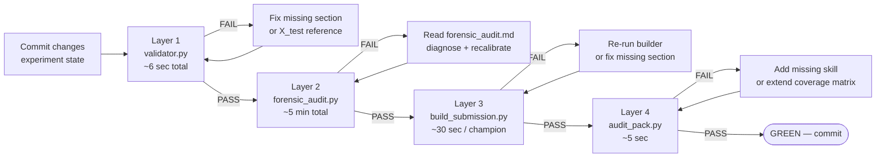

# Chapter 23 — Continuous Integration

> *Parallel to:* SWE-book Chapter 23 *"Continuous Integration"* (Winters, Manshreck, Wright 2020).

**Thesis.** Continuous Integration is the practice of running every commit through a battery of tests before it can land. The SWE-book chapter 23 describes Google's TAP and other CI systems. The DSBench project has no CI service; the **four-layer audit gate is the CI**, run via `framework/_final_audit.py` before every commit that changes experiment state. The convention is informal but inviolable: no commit lands without all four layers green.

## 23.1 What is "CI" in this project

CI in the SWE-book sense is automation. Our analogue is convention: a single Python script (`framework/_final_audit.py`) that runs all four audit layers and exits non-zero if any layer is red. The convention is "run the script; if green, commit; if red, fix or recalibrate". There is no enforcement except the human's discipline.

The four layers, recapped from [Ch. 11](../part_3_processes/11_testing_overview.md):



The flowchart is the literal control flow of `_final_audit.py`. The script exits 0 only after every layer is green; the convention is to not push until the script exits 0.

## 23.2 The CI command

```powershell
& "C:/Users/evija/anaconda3/python.exe" framework/_final_audit.py
```

What it does, in order:

1. Walks `modeling/` + `analysis/`. For each task: runs Layer 1 (validator).
2. Aggregates Layer 1 results into a cohort summary.
3. For each task: runs Layer 2 (forensic audit). Reads existing `forensic_audit.json` to skip recently-clean tasks; re-runs on tasks whose `experiment_log.jsonl` has changed.
4. Aggregates Layer 2 results into a cohort summary.
5. For each champion change: runs Layer 3 (14-section explainability) via `framework/build_submission.py`.
6. Runs Layer 4 (skill-pack coverage) via `skills/autoresearch-pack/audit/audit_pack.py`.
7. Checks for forbidden paths (`_backup_pre_*` under `modeling/` or `analysis/` — Lessons-Learned row 25).
8. Checks per-task `CLAUDE.md` for the Lessons-Learned section presence.
9. Prints the cohort scoreboard and exits 0/1.

Output (excerpt from a typical run):

```
[Layer 1 validator] 112/112 OK
[Layer 2 forensic ] 112/112 PASS (4 WARN — Agent J backbone diversity on qa_excel; ignorable)
[Layer 3 14-section] 30/30 winners with full audit (no champion changes since last run)
[Layer 4 skill coverage] 148/148 sections covered (100%)
[Forbidden paths   ] 0 _backup_pre_* under modeling/ or analysis/
[Lessons-Learned  ] 112/112 with section present
[Cohort scoreboard]
  BEAT-DSBENCH    82 / 112 (73%)
  FORENSIC-PASS  112 / 112 (100%)
  COVERAGE       148 / 148 (100%)
[VERDICT] GREEN — submittable
```

Exit code 0 corresponds to the GREEN verdict. Anything else exits 1 with the offending layer named.

## 23.3 Why a single script, not a CI service

The SWE-book chapter 23 advocates for a hosted CI service (Google's TAP, GitHub Actions, etc.). We do not run one. Three reasons:

1. **Single operator.** The CI's traditional role — preventing one developer's broken commit from blocking others — does not apply.
2. **Hardware contract.** The audit gate's Layer 2 (forensic) runs the runner code; the runner pins to specific P-cores on a specific 14th-gen HX laptop. A hosted CI would not have access to the reference hardware.
3. **Lightweight.** The four-layer gate runs in < 25 minutes on the reference hardware. Adding a CI service would add complexity without changing the contract.

If the project gained a second operator, this calculus would change. A GitHub Actions workflow that invokes `_final_audit.py` on every push to `main` would be a one-day engineering task; the script is already designed to be the entry point.

## 23.4 What CI does *not* run

A few things the gate does *not* check:

- **Wall-clock cohort time.** A regression that doubles the hill-climb's runtime would pass the gate. The runner's performance is convention-tracked (`framework/_summary.py` reports elapsed_sec per experiment); a sudden 2× slowdown would be human-visible but not gate-blocked.
- **Git history hygiene.** The gate doesn't read git; commits that lack a body or reference an issue still pass. This is acceptable for single-operator work.
- **Documentation link-check.** The four-layer gate audits content; it does not check `docs/` links. A manual link-check is in the "follow-up" list of [Ch. 17](17_code_search.md).
- **Python lint.** No `black`, `isort`, `flake8`, `mypy`. The framework code is reviewed by hand; type hints exist but are not enforced.

These omissions are deliberate. Adding them would slow the loop without proportional benefit at our scale.

## 23.5 The "fast-feedback" property

CI's primary virtue (per SWE-book chapter 23) is fast feedback. Our analogue:

- Layer 1 runs in 6 seconds. A missing section is reported within 6 seconds of the commit.
- Layer 4 runs in 5 seconds. A missing skill is reported within 5 seconds of the SKILL.md / CLAUDE.md change.
- Layer 2 runs in 5 minutes. A subtle leakage is reported within 5 minutes of the cohort run.
- Layer 3 runs in 30 seconds per champion. A missing audit section is reported within 30 seconds of the champion change.

Total: < 25 minutes for the full gate on a 112-task cohort with no champion changes. This is fast enough to run as the final step before every commit.

## 23.6 The "no broken windows" principle

A specific SWE-book chapter 23 pattern: never let the build go red and stay red. A red audit gate must be fixed before any unrelated work proceeds. The discipline is informal but real; the May 2026 work blocked on Layer 2 failures three times (postmortems 0003, 0004, and the discovery-event for 0002), and in each case no unrelated work proceeded until the gate was green.

The flip side: a *single warning* (Agent J's < 3 backbones warning on qa_excel) is acceptable because it is structural and documented. Acceptable warnings live in the audit-gate's PASS_WITH_WARN verdict bucket; unacceptable failures live in FAIL.

## 23.7 The CI's relationship to git pushes

Every push to `origin/main` (the only branch) is preceded by:

1. `framework/_final_audit.py` exits 0.
2. `git status` shows no uncommitted experiment-state changes.
3. `git log -1` shows the new commit with a body explaining the change.
4. `git push origin main` succeeds (with the schannel → openssl fix in [postmortem 0005](../appendix_a_postmortems/0005_git_push_ssl_cert_failure.md)).

The pattern is the SWE-book chapter 23 pre-submit + push, compressed into a four-step sequence the human runs by hand. There is no GitHub Actions workflow yet; the commit on GitHub is the post-push state.

## 23.8 Hosting the audit as CI: what it would take

If the project added GitHub Actions, the workflow would be:

```yaml
# .github/workflows/audit-gate.yml (not committed; conceptual)
name: Audit Gate
on:
  push:
    branches: [main]
jobs:
  audit:
    runs-on: windows-latest
    steps:
      - uses: actions/checkout@v4
      - uses: actions/setup-python@v5
        with: { python-version: '3.11' }
      - run: pip install numpy scikit-learn xgboost lightgbm catboost torch psutil pyyaml
      - run: python framework/_final_audit.py
```

Limitations:

- The forensic audit's Agent F (static-code) would run on GitHub's runner, not on the reference hardware. The grep is hardware-independent so this is fine.
- Layer 3 (build_submission) requires the per-task champion state; this is committed to the repo so it would run.
- Layer 2 (forensic_audit) requires the cached `splits.npz` files; these are *not* committed (they live under `.data_cache/` which is in `.gitignore`). The CI run would have to regenerate them, which costs ~5 minutes.

The workflow is feasible but has not been built because the single-operator + reference-hardware constraint makes the local convention sufficient.

## 23.9 Related

- [Ch. 11 — Testing Overview](../part_3_processes/11_testing_overview.md): the four-layer pyramid.
- [Ch. 22 — Large-Scale Changes](22_large_scale_changes.md): the LSC playbook that ends with the CI gate.
- [Ch. 24 — Continuous Delivery](24_continuous_delivery.md): the post-CI delivery pipeline.
- [`framework/_final_audit.py`](../../framework/_final_audit.py): the CI command.
